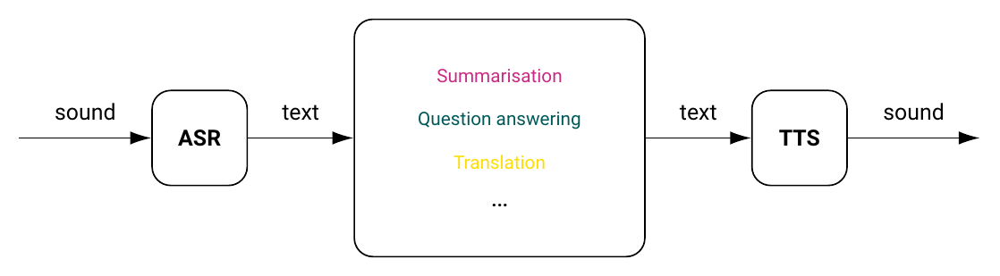
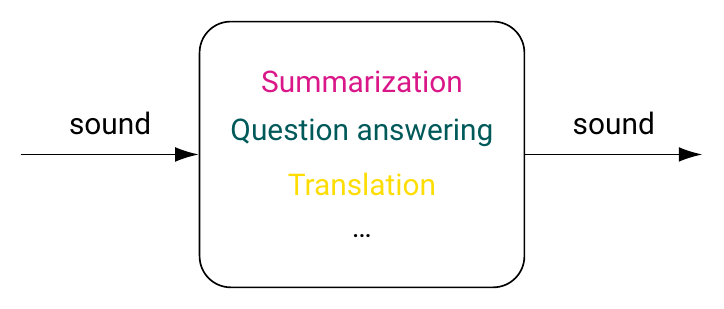

# Background

## Last time

The sound side of things:

-   phonetics
    -   articulatory phonetics
    -   acoustic phonetics
    -   auditory phonetics
-   phonology

## Today

The visual side of things:

- writing and its basic principles
- writing systems

<!-- Putting it all together:

-   sound/sign, writing, and language technology

# Sign languages

-->

# Writing

## Definitions

### Writing

A system of recording language by means of visual or tactile marks.

-   why visual?
-   why tactile?

------------------------------------------------------------------------

-   **writing system**
    -   writing system of individual language
    -   abstract type of writing system
-   **script**: graphic form of units within writing system
    -   ‘Over the course of its history, the Turkish language has used the Arabic and the Latin script’

------------------------------------------------------------------------

-   **orthography/spelling**: standardised conventions of particular language-specific writing system
-   **alphabet**:
    -   inventory of basic signs of phonological writing system
    -   inventory of basic signs of *any* writing system in general

## Writing and speech

Writing is always secondary to speech.

-   overwhelmingly many languages have no consistent/standardised way of writing them down
-   no ‘writing-only’ languages with no sound/sign form
-   written form can change without significantly affecting language
-   written form can remain the same but the language itself can change substantially

. . .

In fact, writing is a (legacy) language technology of sorts!

## A few contrasts

Do you agree with the following differences? Feel free to disagree!

::: {style="font-size: smaller"}
|      speech       |     writing      |
|:-----------------:|:----------------:|
|    continuous     |     discrete     |
|    time-bound     |     timeless     |
|   context-bound   |    autonomous    |
|      audible      |     visible      |
| produced by voice | produced by hand |
|                   |                  |
:::

Can you think of more differences?

## What does writing record?

Writing records **utterances**.

-   which are combinations of **meaning** and **sound** expressing that meaning.

Which of these two aspect should be written down?

-   primary focus on meaning?
-   primary focus on sound?

## Writing down sounds

::: incremental
What are the pros?

-   clear instructions as to how a string is to be pronounced

What are the cons?

-   Where do we even start?..
:::

## Writing down sounds: the cons

-   too much variation across languages and within languages for this to be plausible
    -   /pɑ(ː)t/ is the UK pronunciation of *part* and the US pronunciation of *pot*
    -   /ɡɑ(ː)d/ is the UK pronunciation of *guard* and the US pronunciation of *god*
    -   the *t*-like sound in the word *bottle* can in fact be realised in several ways

Punchline: one must not go too far, since the words must ideally be recognisable for outsiders, too.

## Writing down meaning/thoughts/ideas

::: incremental
What are the pros?

-   most of the meanings could be made easily recognisable, thus facilitating learning

What are the cons?

-   Again, …
:::

## Writing down meaning: the cons

-   with the average vocabulary of an average adult speaker of roughly 40,000 words, that would entail learning 40,000 distinct symbols
-   additional signs for writing down grammatically relevant information (present/past/future tense; masculine/feminine/neuter gender *etc.*)

Punchline: one must not go too far, since the inventory of symbols should still be manageable

::: notes
In other words, writing ‘pay this fine or go to jail’ might work when using a concatenation, or sequence, of 7 picture-like symbols (think emoji!), using the same method to record ‘if you had paid this fine, you wouldn't have gone to jail’ is already much trickier.
:::

## Writing down words

So-called **logographic** writing systems

-   Egyptian hieroglyphs
-   Chinese/Japanese *kana* hieroglyphs
    -   [山]{lang="zh"} *shān* ‘mountain’
    -   [木]{lang="zh"} *mù* ‘tree’

## Writing down rebuses

-   [木]{lang="zh"} *mù* ‘tree’ + [氵]{lang="zh"} ‘water’ → [沐]{lang="zh"} *mù* ‘wash oneself’
-   *cu, 4u, 2u* and many others in English
    -   definitely not an innovation, goes back at least to Sumerian, Akkadian/Babylonian, Hittite in Mesopotamia
        -   written using **cuneiform** (check out [**this page**](https://www.britishmuseum.org/blog/how-write-cuneiform) for some info on cuneiform, and a video tutorial)

## Writing down different sound units {.allowframebreaks}

-   logographic systems
-   phonetic/phonological systems
    -   writing smallest sound segments
    -   writing syllables

------------------------------------------------------------------------

::: {style="text-align: center;"}
{width="50%"}
:::

## What do alphabets record?

-   vowel sounds
    -   vowel length
    -   fronting (e.g. Estonian)
        -   *a -- ä*; *o -- ö*; *u -- ü*;
    -   nasality (e.g. Portuguese)
        -   *a -- ã*; *au -- ão/am*;
-   consonant sounds

## Syllabaries

Japanese uses two distinct syllabaries, the Hiragana and the Katakana, alongside the ‘Chinese’ *kana* hieroglyphs.

::::: columns
::: {.column width="45%"}
](https://kuwashiijapanese.com/wp-content/uploads/2017/01/hiragana_chart2.png?w=1326&h=802){width="95%"}
:::

::: {.column width="45%"}
](https://kuwashiijapanese.com/wp-content/uploads/2017/01/768px-table_katakana-svg.png){width="95%"}
:::
:::::

## Korean writing

A curious hybrid of an alphabetic and a syllabic writing system.

](https://bylinina.github.io/ling_course/_images/hangul.jpg){width="45%"}

## Abjad

Only the consonants are recorded

::: incremental
-   Th clv(r) snk dsp(r)d nt hl n th grnd
    -   The clever snake disappeared into a hole in the ground.
:::

------------------------------------------------------------------------

::: {style="text-align: center;"}
{width="70%"}
:::

. . .

::: {style="text-align: center;"}

:::

## Abugida

Basic characters denote consonants followed by one dedicated vowel, other vowels being denoted by additional signs.

::: {style="text-align: center;"}
{width="90%"}
:::

## Writing, lineage, and culture

Closely related languages sometimes share a writing system

-   most of the European languages, for instance, use the Latin alphabet, with some adjustments here and there.

However, that is by far not always the case.

------------------------------------------------------------------------

-   Germanic
    -   German vs. Yiddish
-   Romance
    -   Romanian; Ladino
-   Slavonic
    -   Russian, Polish
-   Semitic
    -   Hebrew, Arabic, Amharic, Maltese

## Romance

### Romanian old and new

::: {.panel-tabset}

### Contemporary Romanian

::: {style="font-size: smaller"}
Tatăl nostru, Care ești 
în ceruri, Sfinţească-se numele 
Tău, Vie împărăţia Ta, Facă-se voia Ta,
Precum în cer aşa şi pe pământ.
Pâinea noastră cea de toate zilele
Dă-ne-o nouă astăzi. Şi ne iartă nouă 
greşelile noastre, Precum şi noi 
iertăm greşiţilor noştri. Şi 
nu ne duce pe noi în ispită, Ci ne 
izbăveşte de cel rău.
:::

### 19th-century Romanian

::: {style="text-align: center;"}
{ width=40% }
:::

:::

## Romance: Ladino

::: {.panel-tabset}

### Ladino (Hebrew script)

טודוס לוס אומאנוס נאסין ליבריס אי איגואליס אין דיניידאד אי דיריטוס אי, קומו איסטאן איקיפאדוס די ראזון אי קונסאינסיה, דיבין קומפורטארסין קון אירמאנדאד לוס אונוס קון לוס אוטרוס.

### Ladino (Romanised version)

Todos los umanos nasen libres i iguales en dinyidad i diritos i, komo estan ekipados de razon i
konsensia, deven komportarsen kon ermandad los unos kon los otros.

:::

## Slavonic

::: {.panel-tabset}

### Russian in Arabic script

### Same text in Cyrillic

Прарок мувил: Ужо йа из сего сьвета зийду, тилко вам йеден дастамент адказуйу; посьле мене, майе тевариства, не разлучайцесе, у адном мейсцу пац вахтав немаз кланийцисе.

:::

## Summary

-   **Logographic** writing systems focus on *words* (Chinese, Japanese hieroglyphs)
-   **Syllabaries** encode syllables (Japanese, Korean, Amharic, Hindi, Tibetan, …)
-   **Alphabets** encode individual sounds (English, Russian, Armenian, Greek, …)
-   a lot of halfway, in-between systems (Arabic, Hebrew etc.)

<!-- # Overtime

## Articulation test

::: {.notes}
A child gradually acquires the sounds of their native language — some earlier, others later. Children who have difficulties mastering certain sounds receive help from speech therapists. To assess how well a child has acquired the phonetic system, speech therapists use articulation tests. In these tests, the child is asked to name pictures, thus collecting examples of their pronunciation of all the language’s sounds.
:::

The results of an articulation test of a Canadian French-speaking child with defective articulation compared with the literary (standard) pronunciation of these words are as follows:

## {.scrollable}

::: {style="font-size: smaller"}
| Word      | Literary Pronunciation | Child's Pronunciation | Translation |
|-----------|-----------------------|----------------------|-------------|
| pomme     | [pɔm]                 | [bɔm]                | apple       |
| tête      | [tɛt]                 | [dɛt]                | head        |
| soupe     | [sup]                 | [xup]                | soup        |
| queue     | [kœ]                  | [gœ]                 | tail        |
| phoque    | [fɔk]                 | [bɔk]                | seal        |
| princesse | [pʁɛ̃sɛs]             | [bɛ̃xɛx]              | princess    |
| rêve      | [ʁɛv]                 | [ɣɛɣ]                | dream       |
| neige     | [nɛʒ]                 | [nɛɣ]                | snow        |
| vache     | [vaʃ]                 | [bax]                | cow         |
| mouffette | [mufɛt]               | [mubɛt]               | skunk       |
| plume     | [plym]                | [bym]                | feather     |
| fraise    | [fʁɛz]                | [bɛɣ]                | strawberry  |
| chien     | [ʃjɛ̃]                | [xɛ̃]                | dog         |
| gorille   | [gɔʁij]               | [gɔɣij]               | gorilla     |
| tomate    | [tɔmat]               | [dɔmat]               | tomato      |
| bleu      | [blœ]                 | [bœ]                 | blue        |
| livre     | [livʁ]                | [jiɣ]                | book        |
| dire      | [dziʁ]                | [ɣiɣ]                | to say      |
| donner    | [done]                | [done]               | to give     |
| cochon    | [koʃɔ̃]               | [goxɔ̃]               | pig         |
| cadeau    | [kado]                | [gado]               | gift        |
| zèbre     | [zɛbʁ]                | [ɣɛb]                | zebra       |
| dur       | [dzyʁ]                | [ɣyɣ]                | hard        |
| soif      | [swaf]                | [xwax]               | thirst      |
| fleur     | [flœʁ]                | [bœɣ]                | flower      |
| salade    | [salad]               | [xawad]               | salad       |
| bon       | [bɔ̃]                 | [bɔ̃]                 | good        |
| cheveux   | [ʃəvœ]                | [xəbœ]                | hair        |
| drapeau   | [dʁapo]               | [dabo]                | flag        |
| musique   | [myzik]               | [myɣik]               | music       |
| train     | [tʁɛ̃]                | [dɛ̃]                 | train       |
| éléphant  | [elefã]               | [ejebã]               | elephant    |
| plein     | [plɛ̃]                | [bɛ̃]                 | full        |
| voiture   | [vwatsyʁ]             | [baɣyɣ]               | car         |
| cloche    | [klɔʃ]                | [gɔx]                 | bell        |
| nage      | [naʒ]                 | [naɣ]                 | swimming    |

-->

# Decipherment of Sumerian

## Clay tablets

## The Behistun inscription

![](data:image/jpeg;base64,/9j/4AAQSkZJRgABAQAAAQABAAD/2wCEAAkGBwgHBgkIBwgKCgkLDRYPDQwMDRsUFRAWIB0iIiAdHx8kKDQsJCYxJx8fLT0tMTU3Ojo6Iys/RD84QzQ5OjcBCgoKDQwNGg8PGjclHyU3Nzc3Nzc3Nzc3Nzc3Nzc3Nzc3Nzc3Nzc3Nzc3Nzc3Nzc3Nzc3Nzc3Nzc3Nzc3Nzc3N//AABEIAOoA8AMBIgACEQEDEQH/xAAcAAACAgMBAQAAAAAAAAAAAAAABQMEAQIGBwj/xABBEAACAQMDAgMEBwYFAgcBAAABAgMABBEFEiExQQYTURQiYXEVMoGRlKHRIzZVdLGyB0LB4fAzUhYkQ2JygpLx/8QAGQEBAQEBAQEAAAAAAAAAAAAAAAECBAMF/8QALhEBAQACAQQBAwIDCQAAAAAAAAECETEDEiFRQQQTYTKhceHwBRQiI1KBscHR/9oADAMBAAIRAxEAPwDy/wAQ65q8ev6kkeqXyqt3KAouXAA3n40v+n9Z/i9/+Kf9aPEgz4i1T+cm/vNLsUDH6f1n+LX/AOKf9aPp/Wf4vf8A4p/1pdijFAx+n9Z/i1/+Kf8AWj6f1n+LX/4p/wBaXYoxQMfp/Wf4vf8A4p/1o+n9Z/i1/wDin/Wl2KKBj9P6z/F7/wDFP+tH0/rP8Wv/AMU/60uxRigY/T+s/wAWv/xT/rR9P6z/ABe//FP+tLaKBl9P6z/Fr/8AFP8ArR9P6z/F7/8AFP8ArS2igZfT+s/xa/8AxT/rR9P6z/Fr/wDFP+tLaKBl9P6z/F7/APFP+tH0/rP8Wv8A8U/60tooGX0/rP8AF7/8U/60fT+s/wAWv/xT/rS2s4oGP0/rP8Wv/wAU/wCtH0/rP8Xv/wAU/wCtLaKBl9P61/FtQ/Ev+tH0/rP8Wv8A8U/61DpNhJqeoQ2ULKskzYUueBxn/So7+1eyvri0kKs8EjRsV6Eg4OKm5vXyndN9vytfT+s/xa//ABT/AK0fT+s/xa//ABT/AK0trNVTL6e1r+Lah+Jf9ax9P61/FtQ/Ev8ArXb/AOE2j6dqmk+KG1CyguZILdDC0qBjGSsuSPToPurzfqK8en1sc+pn05zjr95tdeNmP0/rP8Xv/wAU/wCtH0/rP8Wv/wAU/wCtLaK9kdNrM9lFruoSeWfMF5KG/wD0cn7/AOpqiLnTfKCNCxHuluOp796YawdOk1/UhMoDi5lzuJUEhz/t+dL0l0wTGV1Y8kgYOc54746Y4+dZdUt1zGXfTBCjJECxPvDnI55OM+nb5fGoZ5tPKOsNthiOCc8Hn4+u3861tJbJBJ7QhJZuMD/LmpfM0wsDsIGeRyeM/wBcUTe58NbKWyhTzJUDSBxtAB6cfH1oWfTgqn2bLcZBBx8e/T0+VSLNpwjV2RS5Ujbg8Hb8+mftrR5dMOT5bZbOeox+dDicxXvJLRlQW8TKQOSePv8AX8qm0uytrqOQ3E4iZWUDLqoIPz7/AJdea1M9olkyRqfOdMMeeuR8fgal0fSxqEZYuV2yhTtGSQQeg9aXh4dX3tYbTdMSLDXmZvLDe7IpUNhjj48gd+9bvpulRsUW7DM24KXlXaMLkHI9eP8AeiXw2VkwtyNrcgbCSASME/Dnk9sGtX8NvHKsTXHvswXAj+DH16YXP21Nz28dz2h1CwsLeCXybnfKp90eYrDGEyOBycs3/wCaq6TpV1qsssVmqs8cRkIY44Hx9at32hexwSu10rSRruKBCO69/wD7itNAtdQuZLkaXdGCURqCqz+WZAzqgXqM8sOvFXfjlrHgxufBl9FI8ccsTsty0HPH+UMpPXqpJx2A61H/AOD79YiJHjFxvKmFcNs95BliOg9/Pfj8pU03xP5cdxFeTbHVjHIL3Ab3gMA55JJXHrkVL9F+JNisL+43w+a7g3LYiVQjlg2cHO4Hj/trHdf9UbJtV0C90qHzbvyQPMMZVJAzKcsBkehKNj5Uqrqb/wAN65NN5TXAvGdjz7UCJGDuDjJ5IO4n03GufvrOWyn8mbbu2qwKMGVgRkEEdeDW8bL8orUVnFdV4I8FzeKjcsLn2WGALlzHu3E9uo9DVyymM3Vk3dRzPkuIhLtPlltobHGfTNPvFCKtppexFBaHnA68LXoVj/hfqFkksMWp2V3ZPy8U8bJn498Gp5vAt+0e+JLPz7UbIfNZmAHHOAPl15ry+9h7fU+n6PS+xnvPVuv+fj28VkR43KupVh1BGCKwBXo7f4W69c3b3OqXVqsbHc7xMWZvgFwOa6If4X+HrKK2a/uL5mmH1Nyj7/dyD9tL18I+fend+HHeEtCVtQ0vVNOuUuIkI9qizh4XKnPHcZqt4l0FLabVNR1K6SFpp5GtLdeXly3U+grttN8B2FnEmpWF3qSTgkBI3Rc++Fxypz16HjirSf4b2Gpaks+qPqOTku8swy/U4Pu8Y/8Abgelc33P8zu7vH8HJ/det97v7vH7vEDTvwhcaNBrCf8AiO3abTpEaOTYMshI4YY54Ppz869Rj8MaEb2GK00q1+j43ZXknb3nwPrFiwJ57Z7VJbeEfCz3kouoNPaIhmAjlZWwFyMANxyDnnnIGOOfXPr4ZY3Hz59Ov7VMvAnhGPRrbXH0nUIr/TtTt0FnMGGcgSDDY4/zDn8hXnnijR/DfhTQZtJM66j4lm2eZKn1LUBgSo9CQMevPYHFd5on0B4d0+SDT7tLR5UzcW7XDsSxA7g8Ec8jnpz60NSsvDtvcs9rptibSBMSyyDCs5wQC2CWb4fOvndDp9XDrZZ557l1+Lde/wCXLdw8PEzWKceKbaG21m5FqoWB3LRqOgU8gfcaT19qXc28LNV02vy6cddv1mj5W7lJ27hk7j1+2l1mNPf3JcKWJ5JPTORzxWniT94tU/nJv7zS2mnp93zxFy+NrkLbLgqxBIJII49fjmqlYrIFV527u13R7dLzU7e3mzskbBwcGotRiS3vriGPOyORlGfQGn+iaWjT6ff2cgkVSBcJnmNsHn5VpqejNvuZ5Mm5uJytrboMs+W64+VZ35fQv0ec+m7+353v8an9fxc3WQzL9UkfKuysP8MvEl2pZ4rW1UHBM9wOD6e7nmr7f4TaqIWMep6dLMp96NGfA79dv+lT7mHtwdmXpxujWM+r6jDYQyqjy7gpcnaOCT0+VRahcXTXTC5naSSIlN3yJ/3r0bSPAt1oerabfs4Plgi4TOQGKkZU9xz0PNc54m8LTaVYe2ziR7i5uGYBFzHGnvdW9Scfca8sfqMb1O3blx60vWvT/H/rkt7HqTU1ne3NlKZbSZ4XIwWQ4OMg/wBQD9lQGp7W0uLuQR2sEkrnoEUmuh0Gmiahe3epaZYT31yLU3EUW1ZCNql16enQY+Qp1/iL7VoHim+0uxv7w2vlKuJJixYMihgfnjHyrpPC/gODU9N026WC60vWLOVWlFxGwiuwHyCM8g4wPs6HrXYeIPA+lah4rl13WpDPG6IsVmowCyjG5j3HTj789K+R1f7Q6eH1Uw88Xxr53Nf9vSdO2PCRr2rlsrqFyGZgeJCMkMWH5kmu70H/AAm1fWLaG71S+itFKLtjdWeRVxwCOMcfGul8P+BNI0rUra9shNPc28mUFwykMemdoHTvyR2rqtX1KSxtLkRFpr/yi1vb9nc8DOPj8a68/qN+MG8elrku07/C3wjaqBNbm7kwPelmPXvgDApxNaQ6TaT/AEJa2dsAoKmKIbGCjkkL37fZXO2N9qhtIl1SONLt7Z5HiixthbcABx3x+ZNVbH6RudJvH8+3j0q3mcyGQEuWIB2KoPTn1xzXhlcry9JImudb1d9MkuCHd5FVRGljKqDcw7sRk844B/1olm8TtfJLeEQK6mTbCG6AE4+HT/neW2fxDfx2ctleWrb8GMNAwSMbeucYyKhvNP1afUYBFq5uJVOJWjjCoMA8cn0+NZ2tZvLLUrx4Y47mZxKxeQO4QYA46bu56Vd9kubUWovp/MkV8qiyZWP3SeScEnjsBiqUeh8h5tbuAzfXBmXGPeJGck4woqRDbNOiWN15wUsSQP8ANsbBJ2ZP2mgX2NkbhGkuLm8EbM6Iscyphe5UHk5PFM49OsNNInkmmmlkJEMFzMuyNegyAeT8Dn5VS0uO0sllu9Tmt1uZcoqb9zAdtwwQP+Crll9A2bpBpOx5lj/b3GDI445y/O0fcKCjJaNqTWS3N3bxR4lfEuQPrHAABGTyPhRZ6Z4dWf2iS6SW3ssoAoO2STAOMuzE4yDxjrWLuPRttjcazO2Le3DJbRthnZhnJPYAf1+FaRXmhxKq22irJcvHGsXuCQR5ySWJ789T36mgLe68PmG7vLmRt7NIQqSFWUYG0A9R3/Ok3iO5stR0/TbW0b2Kzhi3tHjeck9+nvHg5PSnEV5psUAtbPTXlQo37NWWTIUAZbavHr1pZqup6RLa2xi0tRGsJVpCAnmOQMnODwKs8Fcbrvh2eSyl1XTwZ7OIgSMWy6nucZzj41yZ611+rXNv7NN7Gggjc+/GrZBFcg3U4rv6Ntx8ubOTZj4k/eLVP5yb+80vjRnYKoJY9AKYeJP3i1T+cm/vNdV/hHpUN5r0t/crvTT4/NSPI96Q/V+eME/YK3nl242pjN3StpH+GXinU1R10828bruV7hgmfs+sPur0HRv8MdA0uBW1uaS9uVH7RU92MHnHxI46kjpXbfSFzKHbymA254bkfDrXBa//AOI0vnhs72EoMHeLcjAO4hT1zgfL7a471cs/nT2mEh0+k+FrOzuBZ6QYmbYgkjcF+vYkkjHx61o0Wi201tcWmlD2qItuuZkJZAFbG09CSQfsPxFcpb2fiaS8RbvUGWLfx5URwwwWJx3HQc9z95HomtylRJqskL+oRWDcnJwe+OKl9bes6ufZ2b8ejPxBPreoapMLW+ubeyVysccSAbQEHQ9+/Y1pZ6leaa1vHFPNKGdhI03BbCMcHnH5UrGi3ktxIx1K+kUSNGCsqpuAX3jg8dc9P1qeKxis5IWCyBhvO+afeTxgdSfXpxTxrTzdjoOtSSaZC2rJlHTkPtz14PUk8d+PlTq2gsNRtXWOf9m+coRlSM/VINeaWXhs3WnpNeGRbuRMpHJcNGCMdwuT0+X2U/sbO00u3WOW7SCOPJz7Qc47EnsD16nOa87jGp7dXaaBpkMBjTSdPLoMZECe98+KuW2lzRxLFGVtoxzi3UL9gGOO9c9BrtvY2gPtiLuYBZboYBGA3QAHoazc+LYrllS01eGLarNJ5YEjkBeAB8Tk5rOreV3rh1axWliFlnbDHHvSNuYff/zmud1fxPo1renzEubmUdkjJTHz6df61zl94j0ySZLi5uzd+USFXapBJyOnXocde9UbjUNCthDK9uY1OHQvk+dtJx1OMZyR25zTtm+E5OV8cxJJK5spbaBFYl8Yyf8A5Hgn4DP3CqsdxcN58l0Ns8iq4iK5Me9jgfMjrjpVG71Z547Xd4fJwdytcIu0HOeGJ+2rdrMbm8vJ2VDKypkRghR9bjJHP5VrStHkMaztLhX9l98q5OPeHfFL9Esb+Xw5cXv0nmEXJ8mySPc80pC4BOfiB0ppMsSpeSTsqosMYJYdiW/SqWmwafcaSrx6pcLdO0iWlrG42qTwHY4yB+mKQNl0/Vr2GWXUL24tCQ0caZwBnA4I4x99a3WjWabLC11Ca5uA6mW4mmCqig+9gAY9ex6GpLfwtaLAW1LU557iFBlkV48984yCfqkZ+6oryz0rS9LuHjmaS5nUIGXcdmcbiFPPGOB15+JNZ2oisvDEEoSW4SWc+8WZ2K497twDxgdO9XZGtZJoRbyOyKrlQC20e6egJx3qlFdWmmW8klppd/H5pH/URosDAG5j19TVo3PtMplSK4SFYn2yTFvf5HKhuft+NQUbOPTN0zX5gll3sfKVDvVcdXODwBu4+NXW1G3vv2GkWwXT4M/9KILGeOCT0+zrVfSmktrS5xayXLSvJligVFUDkA5y3QfAZ+NMLma/v4zNNbDT7BVbykk4YjB6KO/3VUKJptPik0+O/tnupWgQRouDtbYPewR9uegxW1tqiWscsln4enjcKqjZ9UZICjpycHp/SsxOX1AxR6fEYYkV3Maqssnu9M4JI9Rg1O95qF3p/mx2ETK1zmOCfnccjBYADv8Ad8+hVaeSSwtfIs/DawySqdx84EnAJJbDDPcnPrSbWNTYextfWgWKG12RwpLjJ4ySR/QU3kfWwZDHbabCzGSNUijVeAG3HgdsHrSTxJcamrxSalDH5kkGEURllReMn/cirOUrh9XaP2Ntq4GQuQc88/l0rnTT/wAQSu9uhcABm93Ax+Vc/Xf0f0ubPky8SfvFqn85N/ea6b/C69FtqFzEJAs0qKIlPcgkn7cGuZ8SfvFqn85N/eap2txLazxzwMUkjIZWHYit5492NiY3V2+iZ769t4w80ylANokCYPoMjvyf9a5bXINX+kriHS76VlDKXkKDbuIJIPc4GBmmnhbU4PGOkI8jeVcRttuVQ8kADn4bhkcfH7U+r2XimaaVV1ExxIW8oLDgbcHqPXtXBjNXVdN8zajJaeJcJG+o4MshVikZVQoB5zjnkDgHNZh0XeZpW1W7jfceI2wMY44YEjnNV18P6rNPG97e3F4RkAGP3APX6wPapzo1/lYLW8VF2N5jSHKfAY5OevyArdv5ZiD6IilQNc3qbcbpfNZmfA7Bh9UY5/TpV63sNMsXzps0CXRhZvPmLTbRkAf5uDjOKpv4YhuJYBdzRLCrNvWE4JGCeoJ44H5UyhsNKtAy2e2BpYzmWHDMBkDv9v50t8ckQx6VG4nOqaosjzYLzCYoQOcDGD144z64HFay6P4aspI5bnUd8QLMySszhwM4GQeB36fbRa23hu2V0udTSRXmXzVuVOXA6jggfaQakhn8I2l5FPbWsci26BsxxqVeTgADjJbIyMH41FWNXHtkUi3rS28ZuBI6hASilEOCCMEjjjBqOfU9ChsWs7NXi3jBaSJi+PXbjHfNZ1YWEkEk2rC9O6c7o4JCADtQnjHvdcVtP4g017Y+Xa3zo24AlFU8nJO0AH7TkVicKqpf6Anlra6C7wxKMSGMuzHPBJHcn7auLqFxf3wuoNHmdAWiSPzfJJwMnuOgUd/hjPSE61ZybXsdEt0toJAATbKSGI4Ax3wPz+ypLbUbm+sWktLazitbdGWN5PLCITknCkdcEcY9OaUW0v8AW7r3YbNEk8wqGWUN5K8dg3PXv6ipYWuIvOEhzIZFDsqjngnnk46jvmoLMeIJfKiu7GzRAPOk8wICen1mwcH5c4+yrlijqt15ggUiUDbAvAOwdOmfnWaqvPc+XFeFs4VYxwM9m6CtfDeqaNp9nLLa29ub9pXaW5EW8wJwB8s4+XNbStJHHqDqmVQqoUHmT3fj6cn7aNF1KeTQFjg0qdbON5ZJZi3lK7F24z/m7DFPgXbPxHZYnuD5jxkgMxO55GOeevQAfmB2NQXd9bajHZNPbTrDcy7Y40BLuoPLDA46EDHxNB1S0Fhiz8NO0GPekliLNtAGMeg4+P51ZnvZ5rqyu5tFlDyBltoZThsYySUHbnvj5VFbQXqyKBZaP5EBbJO8bmwf83ft0J/pWNauruW8nuLuJYikD7I94JA3LjIqe1u9YADw6dEkfKqTLjJ5ycA9evbPFUr8G2W5a6hiLtbklUjAHLDI3dSfiagxbvdafaKlrbQtLdKZJJZpSSCxAwo7clePvq3Oms3cks+pz28FuMpuUFmb1Cr9/JqBri7a8iSJLKKZoQIyiFmGSM7c855HPoK3k029eI3Gr36x2iFwkUa++4yc5zwPjwaqNFu7+a4uYdNaCFDhnPl75CoXOD8M4++i6k1uF7WK8ubbz4lM6xIQixjIxnAG4/AYqKzaSW7u1hkjtkLKxQxxsScdcsQfhxnpWVg19bR7izuUaSWXJCj9pMS5UZJ4AAXPoPvqKkVNWEdtC97Ix28pvRAo2nLHrjr35yftrnPEt9cSX5EVw7sIwjZYkYHYYA445p6LTVpTDGuoSxTTs3mStITuGCc9B2HBB/KuTv7K/Hm3K5Mbu0fnO4zIASM9c4q4pXG6+ZQsQnb3zyFHQDFJaceI0aO6WN2LOo94/Gk9fS6f6Y5cuTLxJ+8Wqfzk395pbTLxJ+8Wqfzk395pbW2T3wbfmy160JleONpVRsNgYJA5r03xX7bqerxW+lGaFEjLPL7RjeeBjBBHoM9a8k0NFk1ezR87WmQHHpmvR9Q0C1FxLNHqV1GHkbG+65AGex5PI6/lxXN1ZJlt7YW9ukWo6ZqEdxb2i6kTcO2x387LKmO/ugYHPb7ali8OS2ULS3moGdEjysKk+++Cec8EDjA/Sl9z4enzAPpQOZBuLSzP5vTp1wOvP/BW1xodtBHi5uoJSZN0jSXDcKAe+4gc46A1n/f9mla30W1EkY1HW0DuC0iCQ9MHIDZ6dvvpqlrpdvbTeUTHbiIFmtdu9hn/ADMS2ar2un6OLmU/TC2zHbtSBhymM8ZX19KtzR2rWt1As0vkeUpZ3JaTbkk9ScnA+ArOVvtYzZyeEbOwQLtvGYADegLliT1Pr68VmS/0RLqKA2/lNajPuSBnLFunI5O3OT1GcZqjDqnhmOUXcIuJXiCrbrKEXyuoyNqjnnPOelXNN1awR2it9EMz7Rt8xgw3FjljnGScjr8qlirN7cwSRmW5hee2N2X8jy/eZTt42/6VZl1F2voFt9ADRxRbUTYEKu4BJIIznAbpmo7llto1luLVbmTzxtgz5YBJXAyPT4cVLa32vgJNp9lYftGfagBUAAMAdw4PU9K8mmsusXtxcmGG3gVkJd1jJPlkjbjO0c4J6dgea0dtYeGKOzTT7cZGYYiQiDGSWY+gHPHpzUsz6zm6i1H2J3WNcRswdVY5IADfW4HXH34rPk31nAiQqs7NMUijtbddqkck/WOcEdTjp1oiSzj164FxcS3duYwAiySvIEfPUqNvPHfp8+yvWdQ1HTrMvp1qbmR7og+SC3vbV6Dr+X3U3ax1iYxNc6y8cOweYRbHJHXjJK56dvyqxYuvkzCBpx+2ba7/AFyMLwT1+ym5KK1y0senyyyQgz7xle6EohI/4eapzapeah4YhiSyu49Otk2ySABQx3YOPU9hxVjVWlXSZzCDkzsV5Bx7qj/SsG7uo/D2lw3+nyLp8cUfliRwDO+M5O3J6j86C2NU1OPTAtlo91GrIEzMowCSMkE4z6Vi91W9+mY5L2wUXcjbLeG4ZTjPT3Rntk8/PsKz7dqV3KHh0WxicqHZzH74HpnnA7Vi5v8AXI72Lz54lvbhgwtojvCDGfe7D+vxqRVq41HWI2MMFqkscIGZ1UEbju7D559BxzUVxb3MYlF/HJdXLQo0qxqTwWJ2jA6YHWohBryxTOZ7lVWQnIiYySN04xnjPqa3vEmtUuf2sk94ViLtjBLHdgKB/rUE1sdRlRJkSGFmX3z7OBtX/t4+PqKie0ma2mutVvR7HFuSKGJcNKByfkOf/wCVat7fXmtvJeV413HLeYqnHPU9ar2unZs0udV1B58n9hbxdXGcDJPOKDWF9Yu7+W3sY5be08/35o0yX9zkcHJxx14rK6HfHSs+23zZGVQnAOSB2ycAM3Tk1m2t9UuPbGW5kt7YyMqKFO0AmtDpOoQWiSTaszMypHDFCuGyx5yc8gDk1FYuPDoW5ija8kgdV274yFIBZVxgrxwSOprltc0yWBpFt76KSGNUG6aQbskA4Axj06V0D6EIImnnuBIxJIEm0qB9kg9O+a5XVIPPmk2yLGi4RSoUBsDJIAJFax5TJyHiQKt/sUghFxkHOT3pTTDWkWO9aNOVUYz6/Gl9fRw/THLlyZeJP3i1T+cm/vNLaZeJP3i1T+cm/vNLa2yaeGIBca/YREZUzqWHqAcn8hXoF5oGmrcXUs8EEUKySNGTNt6Dj3CvA49TXnnh+Qx6vaFQvMgU7umDwc/YTXY6lZeHvPeO3vkiVI9kbtOSS5J3FiM4AGOv3GvDqcvXDhvP4csLq6AtZLTyVPEaSe+xyMkvt9M8YNYk0LT7MJI3sqRIC0kjyk8lsDGI89j0/LvokGhQrmG8tJCo/wDTVCfmf2dauuk3Vx7TJqqxCMKFVAMcHOW24x2xjH643fbSVDoqRvJdalLAk771jjldcr29M96txSWEtldG13Ja+UieZs+sTuydxPJx6ntUEOqeGrS4e4kfzyqhFiX3wR6BT07Vb1K+EkczX8LRqUhJiQf9NSW93pjPIFZy2sRQ6vpa3MAtdHv7oxqI4d43DPTIA93PypjZ6zqcUEYsNDkhmnY7XwMbMk4Uk9Tuzk+tVxrl08KxadotzFLIW8uSVQyjd05Pz/rWbW81mDy4NO0e3hAC4k8wsrHjBJz3x6VitRfuZbjStMN1e28El1G5fyifMAYt3Pc89McEVrBda/e3ytarFbjy/LSCWN4gq4DFjx73TH31Vca3EFM9zYidndo4t2csDnIOOSCenr8qluJPEMQunklWeRh5KyCQ+57uThT8OpJ+XU1nS1pbX99eSXDTXRKqXWTy1EayODjIyTuwB8KngW8ZfZ4r+dpDAC8pjwiE9FBCnJ9ckdu9L4rXXry3jjcu8AUDy4iEVD1yVYAcH76aQ6ZcSp+1mmtVDARttQlh3Y4HPAzwBwRzS6I3ntbKCYe1arc3UoALRmWOMY6A7ce91HGD1qex2rb7EB5mcnLD1x2A9PSqll4dsrwvIJb6OGWXf5gfHmLuAB9Rxux+VWIja2y28EKhRK8nlrgsThm7nJxgdTWbpYg1F3XTXMaLkzOTluozj/Srdtfa1HZabey6dEUMSRW0ckgZgNvLY6Dj1PfFUNVkb6KIhEbPukyrem896p2mteIY4radLKYEQqsRWLeFX6oPf7MiklsPl0kJ167M07WGmxIo2LLKFCpz0AwcfE89KzqTa1G6Ja3XmzPMqko25R2+ooPH20rOveJbuVGjU20SPjfcAxDIycdMk4J6DFRM/i0yGeO4DtsOZDKcL0z27Z7fKp20OLzS9SmmtNt47yeYCFkgaOMnHxOT0zjHaobx5NPiui12bi4Xy1aZBgBve4X5cCqttoOtyMZ7rWJxIzBV9wqRkgcbs4GCe1b6hpUKXEdlY3Uu83AVpd5YMdo7Hvz2x0pZAyXR5prFDNqc8RZgPrd2bHQ/AsftqKQ2aBrawYvBFIivcSPlpGJ9fQc4Arm9b0bxW8PmG5Dpxhm69OBg5xXB3epa1aXBtJ5ZEljblQoyT6/0r0w6XdxWcs9PYEsru7vAJNRgjj2M0aE8R8jLlTyTzx0A65PFZtrPRbK2Fxc6g9z5h2RrICUBABJC55xnH2Uh8K29ldaNHea1qciXkobfCMBlG7A47525+0V0q2WjRSRs8sKRoD5SLlnZTwCT8s/ZXlZq6ahQ0Ohqsksl1+0dyFBg3KAAOq9BknpXLX0Kz3ZZ71SHJSPau1toPUjoo+A7V1+pT+HApDuZnZidq7jt4wBkH4VyWo/Rh3CGS4ztXB9SfrDBx/z89YpXE62qR3vlx5KKoAY9/jS+r2scXzrg4UYGao19HD9McuXJl4k/eLVP5yb+80tpl4k/eLVP5yb+80trSG/hMQHxDYm7KiBZNzlsYwOec13Cx6CJJp7vULdJZS5ijjlCiJTnA4OCcYz91cV4QeKDxBaT3O3yYiXk3gEbQCTkHrXWy3ek3mozXk9xstcBYIoLZXXGDknjA5Pz4+Vc/V5euHDTf4VluGmmmnlLnZFGu8uFAI4x3LenYVburnRLW5RZbSUGOOLy4HjXeRnJbkZ7dOvFZh8RWtt5g06xmFxIFjgYwDeVGQSoA9SO9Q208lteXUkmnXlxcnyw/PuqecAkZ97noTjmvNtmPVtMaa1ig025Dxtu2eVgFsAcg9cfGrV40KSXVzeQvL70R8okqzkbyB8s4+6sJ4kuXaa3g02SGcu4d+Sy5Yk8KCe/pUF4kfstyb1BhTGWR2xkZOQccj+tSxVy81K5mkjaXw7Jt3FwsrKN23OT1OQM/nTK3m1a3VBc2sNioIK2yvudgOmcHCjgdyaTRXeoSRn6PtNKgjjUnFq3mbhxwT2zxzn7KZraX8c7y6tdrNdMSfJh4VfmTyfhWL4aipc6teBoDb28BlcOi7Qo28nJyerHGatwwaotqhu5pnLndsWFk3EgcH3WJHHoKjEF4ZLeOwlktw3mF3h271XJPcgAZxzmhLLUbi6nurnU5pkUeXHlolAOOc5Yj0GV9cetScDa8i1q9nlEd20BKAeWVb3veAwN4BH1iasXEd3YJIXlnv59pVtjbiGzyOgUAVBahLCEyXGoxzX8+07A4/ZKOQox157/AAqpFHZG7kludRgRy3uKZJC3Tk7V759an4DXToj9GW9zqRumu5SzNFcTOoTnKjAHPbjpUMV/BALVJXjR5i4ReOffao4m05nVld7xAThHuGCq5IAz3JJ3cE1EkGlPc6bqGp+aJbdSUiEe5NxJI4wcYxmni0bait4LDzIQi26byRIwBc7mPTrx8qtLf6tYR28SQ2vtEscQCojMEAAwWbGFx168VDrrFtHSS3chdjthgORk/rVu5t9c0+ytwNVknndVxCImbHA5JAOB88Vn4VHZ3niO4cZuLeHcN292TcAR2G79KYXV9eWtpKfaS0iry+5T6EYCjA6fGqSR+JBH5QmmeIABpIIgScdQCWFZGn3dxqECmSW2WIF3kkkR3PTqAwApRdttK1a4Mb3epbMlWbMXJLH59gO9Yu/Ktre6m03cRGWVWyPMdio+r8+OlaDSJLiSRrfWmBebazNtP+XJPB+z7aw9tbS+VDDciO3SVh50rkMxAGT0x2+FRV+3tWtrfN3eSw7QTt80DK+6Bkdu/wAaVeI9G0vVtcWeK4SC6U+UhWMyBwAclhkYAOec1PeWWixtHCt4zyMcNJu3AD1P+mPtrdI9MgupI9PlWS8ljI3puIRQcsTljz2pLYmla3sPD+mWkftGoLcXRidvMWbZySABgE4x359ahS28PWAkdrma5O3Ce0kDA45A4Jz8j2+NYso9BsVMV3dySzQlfMmB9wSNu4AxyB2Bq7KdMght3NhPLEi+XAGtwGycchT7xzgc4qjmdfs/D9yluLWyjhGVD3ABBdyOee9c/wDRVrY+dsaS4m8zaq5GFHz7812zarp0MQuV05gmQFlnKBuFwoAxwOBXKXQt7m7BtCYYBgOwJJc45bPz9K3jllwzZHGanuF7KGGGBwRnNVKs6g4kvZ3XO0ucZ9KrV9CcOa8mXiT94tU/nJv7zS2mXiT94tU/nJv7zS2qjpvAE8MGts1xH5iG3kATbuycenyzXUvf29pqt3O9xfqJUWOKK3gDKBjsCpA+4Vwnh3Um0rURdx8SKjBTjOCQRmunsdc021eW4njubu9nbc0zXJjB+GB/vXP1Je57YWaNYNZn9rn9g0q7Es67UIXDbQTljuxjmoIXuLeO/wDL0tJHjkBe6dt4VwB7oPYjg5GahXxPCUmCqkDMAiOCCVUZzzgEnpWNJ9rv4JBpv0cGknKr5kG6RuOWZu1eevca2aW2p+JCrWlppEaGR23zK+QDkk46DvUN1ttLeZ5dk9xG6Eqqh8nsMcgnPai8TxJbobZXiSWdyP2cTlcEDJLn6oGKhlt3tvLsbJz5kTxq8w6+YTliOOvPx7VLpV65j1S7RHvLi63nLFRZLBj095jz245qaO1Fmnm3V7Le3roHIkYKkWR6DqfnVddNu727neR9WaNH2mRJAFfjnhsH7hW1vpejW6yXN/mZYlXCySkLIx3ZLD7BWasSNp76isEIuGVWGZWicLvGDxz2+fp8asx6Hoskha8QF2cKFV8ADK88HH/dS5zY33kHUiEgT32CrsGwc4XHQEYHFBGiJYokFxYrczc5eEH/AOuTk8eox0NQXlsdDVvI3I0YYzPEoYKqE4XPOM8jtmh5fDNrFIbe2Rlic9EDbjtwAAeMdeT+dQW2neHzaOgE17MyDdLFnjuWLZ4645+VaSX2i2pzGYcBkSKFIlLZGSTlunORx1NRV7SrzTxCnssS3cqMHZkhMccRyTjccDjJ7dvhUF1tZYpSHYiFDt3EKM55z8v+c1Bb69Lf3HlWmkTsSBjKRqi9txZl+B6GrXtDm1RUiEpS3ifGCwOR0x9nWpZo2j1lVOiRKGKlYiRj0Oau6hptykWU1IS3HlqXknuFiEfHZV5J+f3Ut1sxNpFuZSI5DbZTkbv+H9Kvz6JYS3UXsd4IhEqhi8+TNIcdznAAyTxU+FSW2hftALy9u4t2WkcMA7IOBn59ema3NhZXN5GVWNLW3RsLJcGMk/8AczYJJ+FS22i6RHia4mafaGLiOdirHcAowMfGtYNH095Jpr258hHcFbOErtVBxkjHFZVYg07Rkieaa8aJDKciCdsYC5OM8+grW+hs57e3MjGztGkO1HiLHbxySfv5zmswL4btUiaQrIpYtIZEXdz03Lj6o+GBWuotFetBeTyFLVndzhCxZeOAPT40GkreHoolgt4UkBfa0p5ZsdSB/wA/rV+B4P2wgsJolkTb5htBGcDkAkAcVol5ZwW6sunXZDklEJ2gIMY4AwB7v3Z55oj1CK/lUxwJnYx6MexxyfsoIbK6tEMiw2dxd7ffIDD3mORgAAY6dqijv4Pakmh0u1gaM58yS4Bw3PHBJJ9cA1LYGeDTlNhDbxFjuM5WVmPxPG0H5mt9SvdZtbfy0062tUZiiSSTAs369e2aBbd6prM0CONPiSGCMMCAW38YBx0z8+lcjq93cybjJEpG3A2ldv5V2E8OqyRtF5E8UYUM8sjcNgcAAEY9cVx2qPfNNI+oJKjsuSJWySMcDrx1rePLOTh5seY+OmTUdbSfXb5mta+k5DLxJ+8Wqfzk395pbTLxJ+8Wqfzk395pbQFZyfWsUUBT/wAIrf3OqxW1lLcpuDs4gfaSAhOeeO3ekFOfCcU1xrUEFs7pLIHCskmwjCk9cH09Kzl+mrjy9Ci0fWoSXnuNQt41J/6k8ZZvsC4+9gKpTQXQXbarcq8t0o3CRQ+MLkgr079KsT6TqcSpLqFyJSp+q90Xb4gfUA788/Kq1zC81v5MSgk3Kb1Mu9ce6TycDp15rj+XSsxaQZPaTepExzhJH1Aq49chQPj19a0tX8O2RknRbWWRAscPm4bDc5YDueB2zWbWxsbi5vGnk0xki2ov/lzJgkHp7xx345+yr9jFZ2kzTWtjF521I4HkQZRRnJHp2qWmlKSy0i4ie51X2kTP75ymBgnIGM5+ytRd+G2RLeztbp5pGG54cx8Z4UH/ALe3bPesXbWDQwtqqXc/mIGKwvtBJ55wMnr64ptbaxpTIEstNCtjBmnjCD4YLYz6d6m/Ag1DWry5nWCPT5HiiOEjUA5I78H4HnpVJxbaYltOdJSO7uCPLd5mEz56kKuMZye/wroLGGDT7SMQPMzAHLSBQCx6nGN3f1pVd6rLJrCpb2QurlUCIXLEqMYAHO0DPw7GpPwrS0e9ksPLOnS8jyy6x5VQpIzn1zzn51ajMltEgjgmkxbxr7oXAO0d+vepIL7Vby2CtYXS24h+ttVU6fW57ffU9xJIksKYIDJsJ3dNqfPis1SrWraCfTbaKXAZoIwMnnkDkUzm0tGu7oWipa2cO2NGjuRGJDjLEjBye3NLdfjiNvbW05KFYolznGBwOtML6DSJZfJgv7e0sw2JFhhYySD4vmnwfKSw0nTPKMj3F1KIxuKJMQGJbCjjHXB6dakGn2jPPd6g0KKwARV/yAeg+2i4vtK060itLLf5SndJJgsWbpyfh93pUdxfWk8Zd9P9piUe95sWc59MjPbtWVT2V1oUYEi26zMjAJujXLYGFCgercDvxWb2UrqME16k8sqMx8mAA8ngKfQDPb0FQ2Op2wmt/YNFt4GDhtxjBcf5SwA5zjAFYjuGgm817aaaYI4EZyAdxOSw7j4UFr6TfyzLb6PGz7SZSzswXkDueuAKnhm1q9czX3l29milnQggjjoF6Z56mqj6xqLwRrbabCQApbag25zwvB6fCt0j1e8AS6c+zO26bam0bRyVXHqeM0RWs7rUdTjCwPDa2CHbhIxuxz/mwfzqxb2Wp311LeXd6ba3iBAfeNw78cY+7ii1N7NYSTST3McQX3FjZUUAegznFbJoQmTN5qd6lsg8x1I27yenLKOeP96BO9i+oX0sg1a5jhMxU7zguNpP+h79K5PV0Vp7iRn3RqSEQOWz8T8a6XUoIJbiO0s2S3t0DF/2hy3QZLEEmuZ1i3hhjKpN5nJI6449OK9MOWcuHEv9Y/Otay3WsV9FymXiT94tU/nJv7zS2mXiT94tU/nJv7zS2gKKKKAqxYzm2uUlUspXupwfSq9FB6ZYWGn6hDbl76aWBY9zlrrLD4YABWsX9vZzW9xaWa+yxBtm8OMvkAkszA8cj06VynhiXTFeU6vFJLGoBQRtg7vjjqK6Zp9Ou9OkjiRbG1fIXapzjoTjqe/zrkzlxroxssT2NhocZ9hsZ726MQMs8kUuwegJPqe320yis7bYSkco+LXEjn8zSqyfwtFFLbQ+f5YxmRpDF5jY4GVIP38dPWrcU2kxqTD5QBHGbhn/AKmvPK+WpwtSO1rJH5dq9w0kG3AIBGQMnnoMc5q62syzP5cNvDp6cLjcvmuPkmW7egpRJqItthULLL5Gx1DdCVwf61He+JrlvcQJa25xiGM7SqgHg4HJrGmj/BROW3YOcc5yPUUt0vUNQnknk0uwtvLUMJHMOzOOOGC+98utU7fUdSu4dtjbKVC8bQePlxgnr91M5H8RG3t7PyJreNoyqiG33sqjGWYhuCfl3pr2J2k1i90+W6vvLtbTy/cjyS7egC8Y+f5VAtjrc3iO5uJQo0qOE7W3gbnxwPXP5Vb1C21OOznm1HUTJFHGdkC25Rnznglu2Bk/6VBqlxqg1C4hW4jihMmQWdckYHugdT3+8c0l0lY8QrAyQQ3Eioz+UNzDgHK85q/K/hVZnncGRmJkOzG0HPGB8Bxml+uSwwSWqXKM8XnW++RUyDhl44+6mcmp6JPdNNfWsoGNkZKAbexUcelS8L8rS3umpdJZW1u0k8//AKY24UEjjj0A55Na30tpbZ8glmeQHYAiooHQA4z+Y6moF1jS0MosrKRJZ1wvlRsw289B261TuZVu0RZrC5a3QhjnMecc9evasqvRXt1Lci1j0Dc3ChJZAQuO7En4jtWlxJIsxEdtaXUoRkYbcRpyc4GMMO1aW/iEzfsrWBYi6lI1WYueSMkDJPT4d60jkltbjzYPJ9oCMA8jNhRu5xgcnIAxQWbi91Tyklg060iQOBGzKuc47Dn8uaguJfEiBWggkKLF/wBKJcE8Y5B4HX41LPP4hu8GJgCnA8se8xx1JOOKx7NrQV/bNQRIQpZxEvvtznAPbrQb3Ueqy+XbLOTIigFC+F3bcknHRR0Ax2HeobrSEkMi3ctwSqKHY3CjLH5N14PqeajlspZYFnv724t2lOfrrkjHAxknsOoqK70uytJUik1RQAm6XerMzE9APe4OM8/GgozaLBbA+16hbjIP7MMzMvwOG61zGsQ2iIQkzuQpwWXb8hzXQXlro0c7iKadyDkAOR88c5rm9VS2WRhCrFiMAu+4gdfn2/OvTDljLhxZrFZNYr6LlMvEn7xap/OTf3mltMvEn7xap/OTf3mltAUUUUBRRRQZDEHIqX2qbcD5r5HQ7ulQ0UE7XU7HLSsT6k1o88jjDyMR8TUdFTRtsHZejEfI1bs9QmtnyWLqRghiapUUsl5WWx6L4a8QXri30+xvoI1OSscse/HJJwByTnt8q6OO11y6fz7i8/8ALq6nc4Me4Lz7wxwPgc5JxXjIYgggkEHII7VeOs6kY/LN9OU/7S5I/wCcCufL6f09Z1fb1uWxuE069vLu686a4HlxqZAQqdc8dzxUd9bW73k8gu1Lb3zFHt5Y9ecZ6ivLV8QamMA3TsBjhjxxxUg8QXBcPIiFvUcH76879Pn8Nfcxeo6xf2tvqFsJmDRR3MJfaM7drr6d6Yza1psa4NvdM8kbZJgxncckcLn768q0S9N/4k00N5zIJ1kZACxbb72MDr0r0oeJdKF1c3F7ZzS3THEStEec+o9eB8ea888LjqVvHLfk0E2ntDKLfTZYo5SGbcDE0nX5EDoKh1K7t7e0Y2tjJM7KI0j342gDAUevT4VQm1+KO42XkDRMFz5caBUX5npnpWo1C6lkDw2O8IynaW5Tv7w65PoK81XrXUtTvA6W9h7LCfd3Y3beTwD0+HJFVfa5LadIrLPtZVv2qruIQE5wB8cc/KiS+1e5EVvOsdnbKD1DMzYPXaB/UitGu3tylvpyFrqVWO5o/fKgngDHHPP3UFiaHxFdW+6S6ZDIcJGxwMYyc/dnr9lbrYXFoDPqF0ZHyERA5IZsdcYHr6/ZUEtlrMiRZu5DOWIBII2KQTgHbjp8zzW7aXJbBri9vfOlU4RWYt72Mk449ep+6qILTTPOAmu4mG+XhmYKTz1Hv5+3bWbvTdEjkjMcqqqoCd+ZGd2+BP8AzNQ2uhSzQLdateCGWTJETz7VA4xn44I++sTaZp9vcFJr+0YRpkqY3bcec/5vl8sVRXlbSvLiTEZLynfIFG4gcAY59cVzurtaCTNpHtTkDJ5OTjP/AD0p9KmhrghkExXg4JYn5Z+Hr3rntTChlZWOeRjIGPTn/Srjyl4cMwwcVrWzda1r6TkMvEn7xap/OTf3mltMvEn7xap/OTf3mltAUUUUBRRRQFFFFAUUUUBRRRQFFFFAUUUUHReAZVh8V6c5jkkYO2xYxli204AFeq3GraZDGsTadfIqykPlDvLdTu79+cEdcV4ppGoS6Vqdtf2+PNgcOuRkZr02y/xNtSiie1j8xQTud3wxLZJx0Fcv1GGVsse/SymtU6s9RhcNZ6ZpkivLNulZt4VRx7xJ5Hfv2rV9duQNtpY26W8b7E8w7UfqPn3/ACpPN48jmhlS3jtk87ClkznHQ56Vp/4vt7MAJc2UWz6jCEO3I7j1rm7MvT03D6DUtSkRXmu4rSA8BEibzJAP/bgYHWtWa8d4I9MijkuJnbMkxGQgJPUjj7O9c0PEkmosS+pSyIuT5cfu4HxPFaz+IUSMRW8/lALtJLjLc5IyPsp230u3UT2OqKxkbU1URRlid4O0ngDvjgn3sfZVC7kisgYYblrqZ28yWQnIztwoB9OSaSRzwzzSSGRpMjHLkZ4xjNRxXqM7R7o0OeAD6VPIsyTS+Y0hDMASQrt1yf8An3VmKdHlaX2RLawyuUibeWYd2IHr6+lKbm7kMpjiSPzSc7uuR3qi17LYsWC4BIbaOpreONqWx2VwdIlhxGn7R5cMyDDBRg9cdf8AekGrPCiIkcZ3k4HPQc9TSx/ENxgi2hjjBX6+33s1OGupNODO7bMdWzk/6VqYWXdS2WOONYrJrFd7lMvEn7xap/OTf3mltMvEn7xap/OTf3mltAUUUUBRRRQFFFFAUUUUBRRRQFFFFAUUUUBWaxRQZzRmsUUGQSO5ozWKKDdJZEBCOy567TjNWIL148B8uB05wR9tVKKlkvKy2Oht5nnjM8RZdnc9qnlDXcIJwHH1j61zANXLS7cTxh5ii/VL4zgV45dL5j0mft0um2kMheKbAc9D68U01i1ih07ekzhh/wCntO0r2IPSkQgK8u3nRMOHQkH58fOmGq3sN1bqI96rAmxdx64HPHTNc+v8T1+HDmsVmsV3uUy8SfvFqn85N/eaW0y8S/vDqf8AOTf3mltAUUUUBRRRQFFFFAUUUUBRRRQFFFFAUUUUBRRRQFFFFAUUUUBRRRQFZrFFBukskZ/Zuy//ABOKz50mMeY3PxNR0UBRRRQf/9k=)

## Method

:::: {.columns}

::: {.column width="50%"}

* identify repeating symbols;
* identify what language the text is in;
* that's basically it
* just joking, almost
:::

::: {.column width="50%"}

:::

::::

## Three basic steps

* identify Language 1 as Persian;
* identify Language 2 as Akkadian (Semitic);
* identify Language 3 as neither one nor the other
  * observe commonalities in writing and pronunciation

# Sound, sign, writing, and language technology #

## Range of options ##

  * speech analysis/output
  * text analysis/output

## Speech technology ##

  * **A**utomatic **S**peech **R**ecognition (ASR)
      * sound as input, text as output
  * **T**ext-**t**o-**S**peech (TTS)

## Text-based tech ##

  * text summarisation
  * question answering
  * machine translation
  * …
  
## Cascaded architecture for speech i/o systems  
  
  
  
## Speech vs. text: the ratio ##

Current language technology is predominantly text-based. Why?

  * large quantities of data used to train langtech systems are collections of texts
  * written language is easier for computational modelling
      * it's discrete, segmented and neat, as opposed to the continuous non-segmented chaotic mess that is spoken language

## Text-based langtech: potential pitfalls ##

No way to recover information that writing does not convey:

  * intonation
  * general tone of voice
  * personal characteristics of speakers
  * emotion

  
## Text-based langtech: potential pitfalls ##

But also

  * words that are written identically but are pronounced differently
      * either for lexical reasons (*bow* being pronounced as [bəʊ] or [bɑʊ])
      * or for grammatical reasons (*read* being pronounced as [riːd] or [rɛd], depending on the grammatical environment)
      

## Writing is always secondary to speech {.smaller}
      
  * both acquisitionally and historically
      * languages can switch and have switched from one writing system to another — same message with zero similarity in form
      * a written message is necessarily preceded/accompanied by a spoken/signed message that it represents
  * majority of NLP systems *only* know about text
      * if a language has multiple writing systems, a model exposed to all of them separately will have no way of knowing they represent the same language

## End-to-end architecture for complex speech technology ##

## Beyond ASR/TTS: End-to-end sound i/o systems? ##

  * [audio classification](https://huggingface.co/tasks/audio-classification)
  * [Whisper](https://huggingface.co/openai/whisper-large-v3) can directly translate to English from sound input with no text mediation
  * [HuBERT](https://arxiv.org/abs/2106.07447): self-supervised speech representation learning by masked prediction of hidden units
  * [SeamlessM4T](https://huggingface.co/facebook/seamless-m4t-v2-large)
  
## More challenges? ##

  * linguistic diversity
      * accents
          * regional accents
          * foreign accents
      * limited number of languages

## What's the deal with accents? ##

Let's briefly consider **merged vowels/vowel mergers** in different varieties of English.

  * *cot--caught* merger
  * *trap--bath* merger
  
## /ɒ/ and /ɔː/  in North America ##

::: {style="text-align: center;"}

{ width=65% } 
:::

# Overtime

## Chinese writing {.smaller}

::: {.panel-tabset}

### Task 

Given are words in modern standard Chinese and their translations into English in a mixed order.

* [午饭, 桌子, 橙子, 下午, 上海, 橙色, 上午, 饭桌, 红色, 咖啡, 饭馆, 吃饭]{lang=zh}
* orange colour, to eat (to have a meal), dining table, table, coffee, orange (fruit), red colour, Shanghai (literally ‘upper sea’), evening (second half of the day), restaurant, lunch (meal), morning (first half of the day)

#### Task 1. Establish the correct correspondences.

#### Task 2. Translate from Chinese: [咖啡馆, 咖啡色.]{lang=zh}

#### Task 3. What role do you think the character [子]{lang=zh} plays in the words in the prompt?
:::

## Acknowledgement ##

Thanks to Lisa Bylinina for making her excellent teaching materials publicly available.

